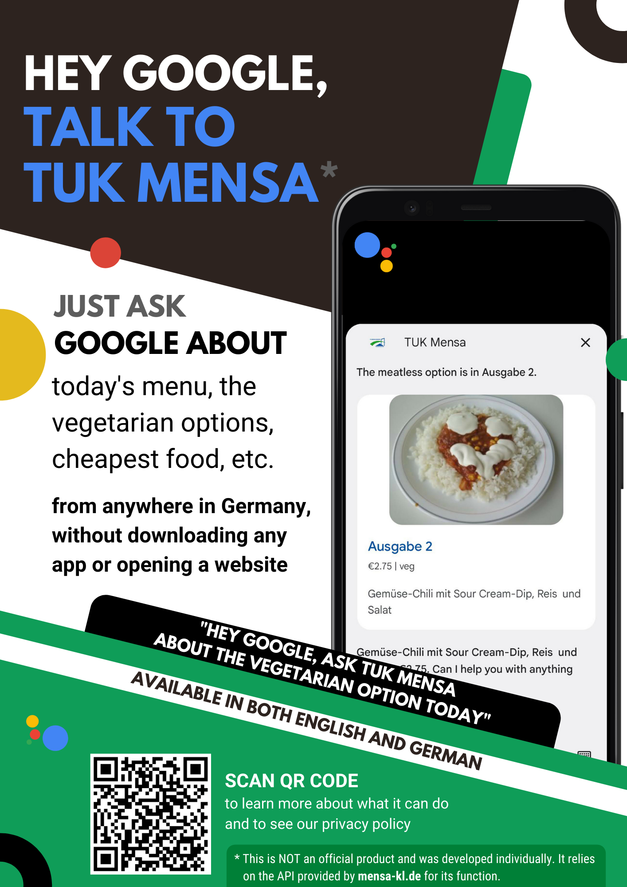
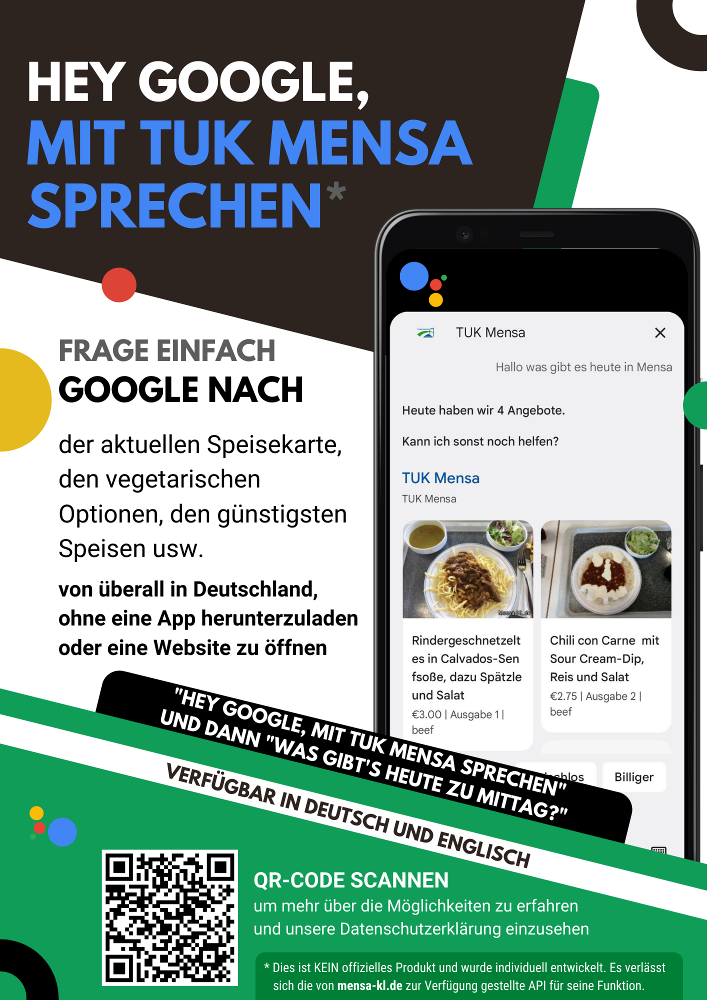

# Conversational Action for Mensa Kaiserslautern

> [!Warning]
> [Conversational actions were deprecated](https://goo.gle/ca-sunset) by Google on June 13, 2023, which resulted in this action being removed from Google Assistant

This conversational action allows anyone with Google Assistant to ask about food options at the Kaiserslautern cafeteria. It is available in English and German.

 

A demo video can be seen [here](https://drive.google.com/file/d/1GZn3izIL4ZdS9FWBtGcY7xFCeBVR8pYC/view?usp=sharing).
